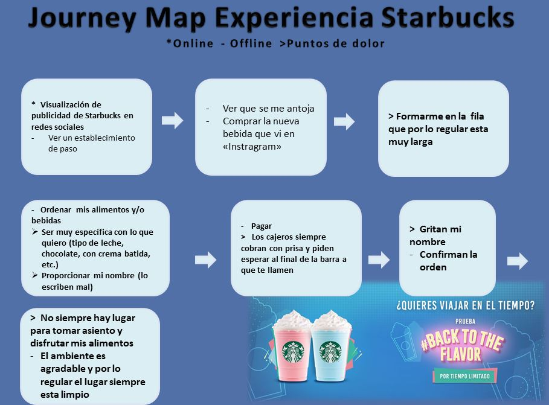
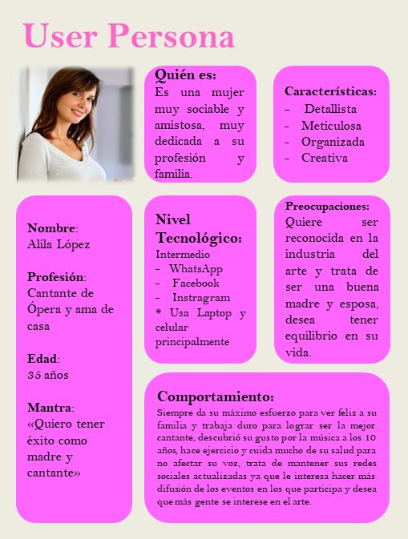

# Journey-Map

## Preámbulo
Journey map se trata de una herramienta de Design Thinking que te permite plasmar en un mapa, cada una de las etapas, interacciones, canales y elementos por los que atraviesa un cliente durante todo un ciclo online y offline.

## Starbucks 
Este mapa fue creado de acuerdo a la experiencia personal vivida en este establecimiento.

# User persona

## Preámbulo
Las personas son arquetipos creados para identificar el perfil, las necesidades, los deseos y las expectativas de nuestros usuarios reales con el fin de diseñar la mejor experiencia posible para ellos.

## Cantantes de Ópera 
A raíz de la investigación realizada en torno a la vida de los cantantes de ópera encontré ciertas coincidencias, como la edad promedio en que son más reconocidos en el sector, desde que edad comienzan a interesarse en la música, cuales son sus cuidados personales y que contrario a lo que pareciera dedican tiempo de calidad a su familia, todas estas características me ayudaron a crear a esta persona.

